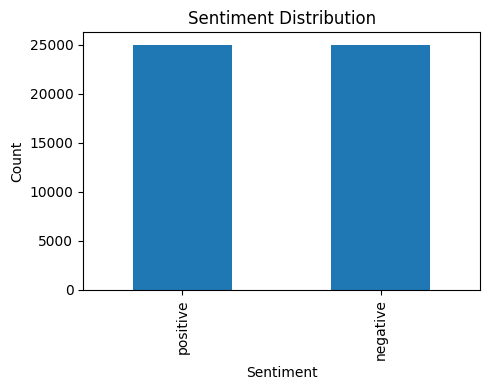
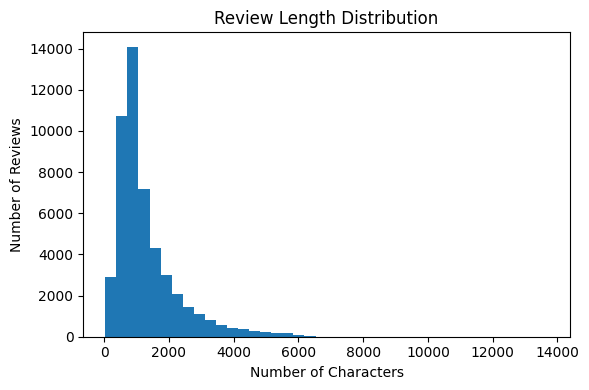
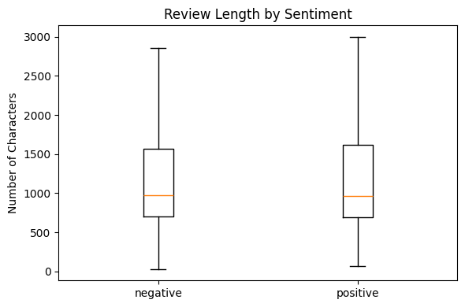
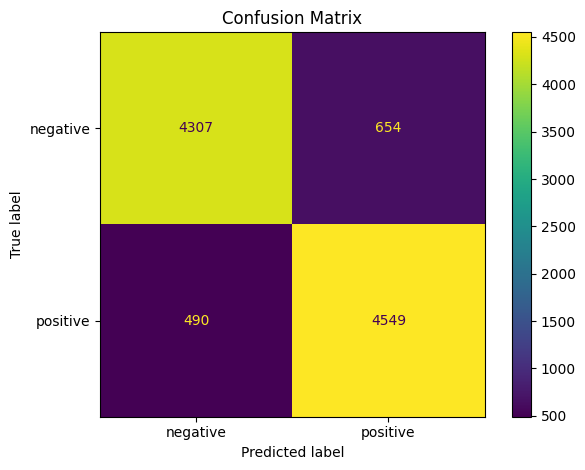

# 🎬 Implicit Sentiment Analysis on IMDb: RoBERTa + BiLSTM + Attention

> A hybrid deep-learning model that reads the *context* of a movie review, not just its positive or negative keywords, to classify sentiment. Built as a UROP research project.


---

## 📌 Overview

Reviews like *"I expected to be bored, but I couldn't look away"* carry sentiment **implicitly**:
the individual words (*bored*, *couldn't*) point the wrong way. Keyword-based models struggle with
this, so the project combines:

1. **RoBERTa** (`roberta-base`) → contextual embeddings for every token
2. **BiLSTM** → reads the sequence in both directions to capture long-range context
3. **Attention** → learns which words matter most for the final decision

The architecture is inspired by the reference paper
[*RoBERTa, ResNeXt and BiLSTM with self-attention: The ultimate trio for customer sentiment analysis*](https://doi.org/10.1016/j.asoc.2024.112018)
(Jabbary Lak et al., *Applied Soft Computing*, 2024).

## 🧠 Model architecture

```
Review text
   │  RoBERTa tokenizer (max 128 tokens)
   ▼
RoBERTa-base encoder  ── frozen (fast, low memory)
   │  768-d contextual embedding per token
   ▼
BiLSTM (128 hidden units × 2 directions)
   │
   ▼
Attention layer → weighted sum of token states
   │
   ▼
Dropout (0.3) → Linear → Positive / Negative
```

**Training setup:** AdamW (lr 3e-4) · linear warm-up schedule · mixed-precision (FP16) on GPU ·
batch size 32 · 3 epochs · best checkpoint saved automatically.

## 📊 Results

| Model | Test reviews | Accuracy |
|---|---|---|
| TF-IDF + Logistic Regression (baseline) | 10,000 | **88.6%** |
| **RoBERTa + BiLSTM + Attention** | 6,967 | **89.6%** |

Accuracy per epoch for the hybrid model: **89.1% → 89.6% → 89.3%** (best checkpoint kept).

<sub>The baseline figure is computed from its confusion matrix below. The two models were evaluated on slightly
different held-out splits (the hybrid model's loader skips malformed CSV rows), and the hybrid model's best epoch
was selected on its held-out set, so treat the comparison as indicative.</sub>

## 🔍 Exploratory data analysis

The **IMDb 50K Movie Reviews** dataset is perfectly balanced (25,000 positive / 25,000 negative).

| Sentiment distribution | Review length | Length by sentiment |
|---|---|---|
|  |  |  |

The baseline's confusion matrix (10,000 test reviews):



## 🗂️ Project structure

```
Implicit-Sentiment-Analysis-on-IMDb-dataset/
├── maincode.ipynb                     # RoBERTa + BiLSTM + Attention: training, evaluation, Gradio demo
├── EDA_UROP.ipynb                     # Data exploration, word frequencies, TF-IDF baseline
├── assets/                            # Charts used in this README
└── README.md
```

## 🚀 How to run

1. Download the [IMDB Dataset of 50K Movie Reviews](https://www.kaggle.com/datasets/lakshmi25npathi/imdb-dataset-of-50k-movie-reviews) (`IMDB Dataset.csv`).
2. Open `maincode.ipynb` in **Google Colab** with a **GPU runtime** (Runtime → Change runtime type → T4 GPU).
3. Upload `IMDB Dataset.csv` to `/content/`.
4. Run all cells. The final cell trains the model, saves `best_model.pt`, and launches a **Gradio** web demo
   where you can type any review and get a prediction.

Running locally instead:

```bash
pip install torch transformers datasets scikit-learn pandas tqdm gradio
```

## 🧰 Tech stack

**PyTorch** · **Hugging Face Transformers & Datasets** · **scikit-learn** · **pandas** · **Matplotlib** · **Gradio** · **Google Colab (GPU)**

## 🔭 Future work

- Fine-tune the top RoBERTa layers instead of keeping the encoder fully frozen
- Use a separate validation split for checkpoint selection, and report the test score once
- Evaluate on reviews with explicitly *implicit* sentiment (sarcasm, contrast, understatement)

## 📚 Reference

A. Jabbary Lak, R. Boostani, F. A. Alenizi, A. S. Mohammed, S. M. Fakhrahmad.
*RoBERTa, ResNeXt and BiLSTM with self-attention: The ultimate trio for customer sentiment analysis.*
Applied Soft Computing 164 (2024) 112018. [doi:10.1016/j.asoc.2024.112018](https://doi.org/10.1016/j.asoc.2024.112018)

## 👩‍💻 Author

**Rishitha Naga Durga Gona**: [@rishithagona28](https://github.com/rishithagona28)
